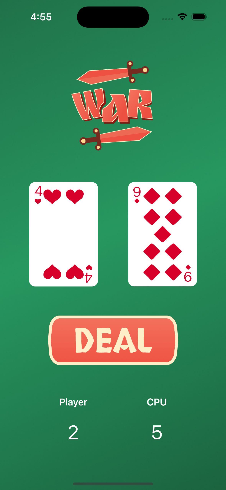
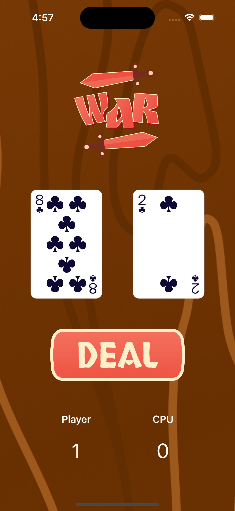

# 🎮 iOS Game Suite  

A collection of Swift-based mini-games for iOS. Built to master mobile development fundamentals.  

## 1. Card War
Inspired by codewithchris on Youtube

## Features  
- **Card War**: Complete with scoring and animations.  
- **Responsive UI**: Works on all iPhone screen sizes.  
- **Planned Updates**: Memory Match game (coming soon).

## How to Run  
1. Clone this repo.  
2. Open `war card game.xcodeproj` in Xcode.  
3. Build for simulator or device.

## Why I Built This  
- To explore **Swift game development** and **UI animations**.  
- Demonstrates **problem-solving** (e.g. game logic, state management).  

## Example Gameplay
 | 

